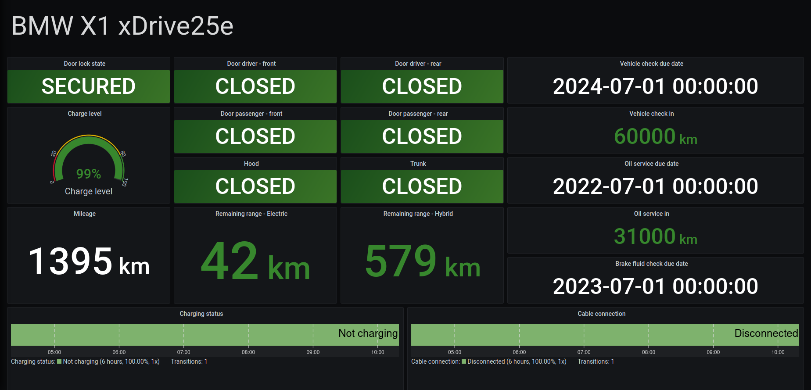

# bmwcd_exporter

BMW Connected Drive exporter to use with [Prometheus][1].

## Usage

The exporter only needs your BMW Connected Drive username and password.

```
Usage of ./bmwcd_exporter:
  -password string
        BMW Connected Drive password
  -port string
        Exporter port (default "9744")
  -username string
        BMW Connected Drive username
```

By default it runs on port `9744`, but it can be changed with the `-port` argument.

## Exported metrics

```
# HELP bmwcd_brake_fluid_check_cbs_due_date Brake fluid check cbs due by date
# TYPE bmwcd_brake_fluid_check_cbs_due_date gauge
bmwcd_brake_fluid_check_cbs_due_date 1.6881624e+09
# HELP bmwcd_charge_level Charge percentage
# TYPE bmwcd_charge_level gauge
bmwcd_charge_level 99
# HELP bmwcd_charging_status Not charging (0), charging (1), fully charged (2)
# TYPE bmwcd_charging_status gauge
bmwcd_charging_status 0
# HELP bmwcd_connection_status Charging cable connected (1) or disconnected (0)
# TYPE bmwcd_connection_status gauge
bmwcd_connection_status 0
# HELP bmwcd_door_driver_front_state Door open (0) or closed (1)
# TYPE bmwcd_door_driver_front_state gauge
bmwcd_door_driver_front_state 1
# HELP bmwcd_door_driver_rear_state Door open (0) or closed (1)
# TYPE bmwcd_door_driver_rear_state gauge
bmwcd_door_driver_rear_state 1
# HELP bmwcd_door_lock_state Doors unlocked (0) or closed (1)
# TYPE bmwcd_door_lock_state gauge
bmwcd_door_lock_state 1
# HELP bmwcd_door_passenger_front_state Door open (0) or closed (1)
# TYPE bmwcd_door_passenger_front_state gauge
bmwcd_door_passenger_front_state 1
# HELP bmwcd_door_passenger_rear_state Door open (0) or closed (1)
# TYPE bmwcd_door_passenger_rear_state gauge
bmwcd_door_passenger_rear_state 1
# HELP bmwcd_hood_state Hood open (0) or closed (1)
# TYPE bmwcd_hood_state gauge
bmwcd_hood_state 1
# HELP bmwcd_mileage The current mileage of the car
# TYPE bmwcd_mileage gauge
bmwcd_mileage 1395
# HELP bmwcd_oil_cbs_remaining_mileage Remaining kilometers before oil cbs
# TYPE bmwcd_oil_cbs_remaining_mileage gauge
bmwcd_oil_cbs_remaining_mileage 31000
# HELP bmwcd_oil_check_cbs_due_date Oil cbs due by date
# TYPE bmwcd_oil_check_cbs_due_date gauge
bmwcd_oil_check_cbs_due_date 1.6566264e+09
# HELP bmwcd_remaining_electric_range Remaining kilometers of electric range
# TYPE bmwcd_remaining_electric_range gauge
bmwcd_remaining_electric_range 42
# HELP bmwcd_remaining_fuel Remaining liters of fuel in the tank
# TYPE bmwcd_remaining_fuel gauge
bmwcd_remaining_fuel 35
# HELP bmwcd_remaining_hybrid_range Remaining kilometers of hybrid range
# TYPE bmwcd_remaining_hybrid_range gauge
bmwcd_remaining_hybrid_range 579
# HELP bmwcd_trunk_state Trunk open (0) or closed (1)
# TYPE bmwcd_trunk_state gauge
bmwcd_trunk_state 1
# HELP bmwcd_vehicle_check_cbs_due_date Vehicle check cbs due by date
# TYPE bmwcd_vehicle_check_cbs_due_date gauge
bmwcd_vehicle_check_cbs_due_date 1.7197848e+09
# HELP bmwcd_vehicle_check_cbs_remaining_mileage Remaining kilometers before vehicle check cbs
# TYPE bmwcd_vehicle_check_cbs_remaining_mileage gauge
bmwcd_vehicle_check_cbs_remaining_mileage 60000
# HELP bmwcd_window_driver_front_state Window open (0) or closed (1)
# TYPE bmwcd_window_driver_front_state gauge
bmwcd_window_driver_front_state 1
# HELP bmwcd_window_driver_rear_state Window open (0) or closed (1)
# TYPE bmwcd_window_driver_rear_state gauge
bmwcd_window_driver_rear_state 1
# HELP bmwcd_window_passenger_front_state Window open (0) or closed (1)
# TYPE bmwcd_window_passenger_front_state gauge
bmwcd_window_passenger_front_state 1
# HELP bmwcd_window_passenger_rear_state Window open (0) or closed (1)
# TYPE bmwcd_window_passenger_rear_state gauge
bmwcd_window_passenger_rear_state 1
```

## Dashboard

The `grafana` directory contains a sample dashboard:



## Limitations

  * Only supports 1 car
  * Only supports Europe

## Disclaimer

I got a lot of inspiration on how to do the authentication part from [https://github.com/bimmerconnected/bimmer_connected][2].

This project is not affiliated with or endorsed by BMW Group.

[1]: https://prometheus.io
[2]: https://github.com/bimmerconnected/bimmer_connected
